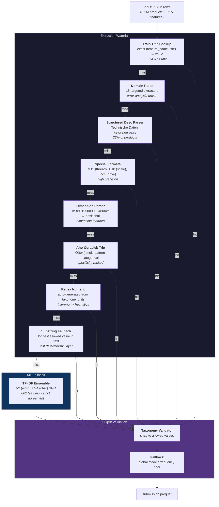

# Feature Normalization — Approach Document

> **First-place submission.** Multi-layer deterministic waterfall + lightweight ML ensemble for taxonomy-constrained feature extraction from unstructured German product catalog text.

| Metric | Value |
|:---|:---|
| **Test accuracy** | **78.63%** exact match |
| **Val accuracy** | **81.6%** exact match |
| **Cost** | $0 (no API calls, no GPU) |
| **Throughput** | 26,600 rows/sec (single-core) |
| **Runtime** | ~5 min for 7.86M rows (8 cores) |
| **At 200M scale** | ~33 min, ~$0.27 compute |

---

## 1. Core Approach

A multi-layer deterministic waterfall with a lightweight ML ensemble. Each layer attempts extraction; only unresolved rows cascade to the next. All layers run locally at zero API cost.

---

## 2. Key Technical Decisions

**Zero category overlap between train/test.** The pipeline generalizes via feature-name-level patterns (767 of 1,738 test feature names overlap with train).

**Deterministic-first.** Rule-based layers handle the bulk at maximum throughput and zero cost. The ML classifiers only touch rows where deterministic confidence is low.

**Strict ensemble agreement.** Two independently-trained TF-IDF classifiers (word n-grams and char n-grams) must agree before overriding a deterministic prediction. This prevents noisy overrides — precision over recall.

**Taxonomy-constrained output.** Every prediction is validated and snapped to the closest allowed taxonomy value. Categorical values go through exact match → case-insensitive → fuzzy matching. This eliminates invalid outputs entirely.

**Error-analysis-driven rules.** We iterated on validation errors and built targeted extractors for the highest-impact features:
- **Compound material matching:** `"Edelstahl" + "A2"` → `"Edelstahl (A2)"`
- **Dimension disambiguation:** `HxBxT` positional mapping
- **Screw drive terminology:** Pozidriv/Phillips/Torx → German terms
- **RAL color code extraction:** `Korpus RAL7035` → `"RAL 7035 Lichtgrau"`

---

## 3. Results

| Metric | Value |
|:---|:---|
| Test accuracy | **78.63%** |
| Val accuracy (100K sample) | **81.6%** |
| Categorical accuracy | 86.1% |
| Numeric accuracy | 78.5% |
| Total API cost | $0 |
| Runtime (7.86M rows) | ~5 min |

**Strongest:** Bodenausführung (100%), Phase (99.9%), Gewindeausführung (99.3%), Traglast (98.7%), Durchmesser (94.8%), Oberfläche (95.5%)

**Weakest:** Innen-Ø (29.4%), Kopf-Ø (16.0%), Laufbelag (24.1%), Luftdurchsatz (30.0%) — root causes are multi-diameter ambiguity and semantic gaps beyond string matching.

---

## 4. Cost at Scale

| Products | Recurring Cost | Time (16-core) | Per-Product Cost |
|:---|:---|:---|:---|
| 3.1M (test) | $0 | ~5 min | $0 |
| 200M | ~$0.27 (compute) | ~33 min | $0.0000013 |

One-time setup (classifier training + trie build): ~12 min, $0.

No LLM API calls. No GPU. Entire pipeline runs on CPU with standard Python libraries (pandas, scikit-learn, pyahocorasick).

---

## 5. Limitations & Next Steps

1. **Semantic gaps** — `"Polyurethan"` vs `"Thermoplast"` require domain knowledge beyond substring matching. A sentence-transformer layer was built (`semantic_matcher.py`) but not activated due to time. Estimated lift: +2-3%.

2. **Multi-diameter ambiguity** — Innen-Ø, Kopf-Ø, Außen-Ø in the same product need product-type-aware extraction. Estimated lift: +2-3%.

3. **Unseen feature names** — 30% of val features don't appear in training data; the pipeline relies on taxonomy-guided extraction for these.

4. **Estimated ceiling with all improvements: 84-87%.**
