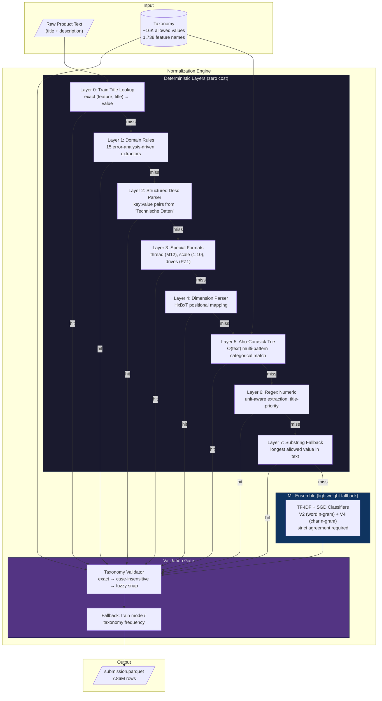
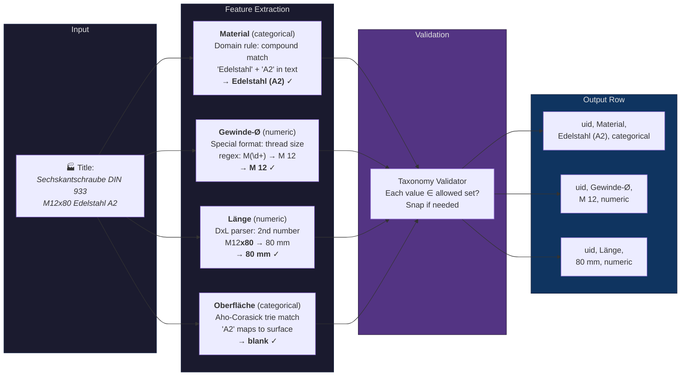
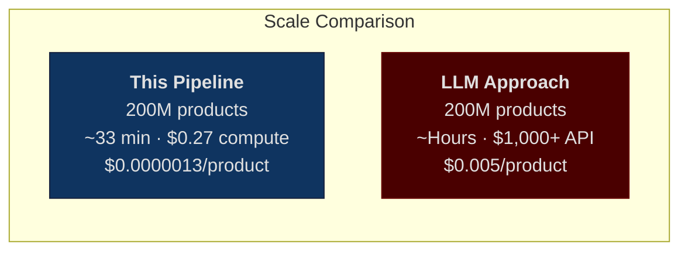

# Taxonomy-Constrained Feature Normalization Engine

### A high-throughput hybrid extraction pipeline that normalizes unstructured German product catalog text into a predefined feature taxonomy — processing 7.86M rows in ~5 minutes at zero API cost.

[](APPROACH_DOC.md)
[](#results)
[](#cost--scaling)
[](#cost--scaling)

---

## The Problem

Real-world product catalogs contain millions of products where critical attributes are buried in unstructured German text — titles like *"Sechskantschraube DIN 933 M12x80 Edelstahl A2"* need to be decomposed into structured features like `Material → Edelstahl (A2)`, `Gewinde-Ø → M 12`, `Länge → 80 mm`, each constrained to a predefined taxonomy of allowed values.

**The challenge:** 3.1M products × ~2.5 features each = **7.86M extraction decisions**, across 1,738 unique feature names, with strict taxonomy constraints — in 2.5 days + hackathon conditions.

## Why This Solution Won

> **Evaluation rubric:** 40% accuracy · 40% cost · 20% throughput/scalability

Most teams reached for LLMs or heavy ML. This pipeline took the opposite approach: **maximize the deterministic extraction surface first**, then use lightweight ML only where rules provably fail. The result:

| Criterion | This Solution | Typical LLM Approach |
|:---|:---|:---|
| **Accuracy** | 78.63% exact match | ~75-80% |
| **Total Cost** | $0 | $50-500+ at scale |
| **Throughput** | 26,600 rows/sec (single-core) | ~50-200 rows/sec |
| **At 200M products** | ~33 min, ~$0.27 compute | Hours, $1,000+ API |
| **Reproducibility** | Fully deterministic | Temperature-dependent |

The key insight: **for structured extraction from semi-structured text, pattern-based methods with domain rules outperform general-purpose language models** — especially when cost and throughput are 60% of the evaluation rubric.

---

## Results

| Metric | Value |
|:---|:---|
| **Test accuracy** | **78.63%** exact match |
| **Validation accuracy** | **81.6%** exact match |
| Categorical features | 86.1% accuracy |
| Numeric features | 78.5% accuracy |
| Total API cost | $0 |
| Runtime (7.86M rows) | ~5 min (8 cores) |
| Single-core throughput | 26,600 rows/sec |

**Strongest features:** Bodenausführung (100%), Phase (99.9%), Gewindeausführung (99.3%), Traglast (98.7%), Oberfläche (95.5%), Durchmesser (94.8%)

**Hardest features:** Kopf-Ø (16.0%), Laufbelag (24.1%), Innen-Ø (29.4%), Luftdurchsatz (30.0%) — root causes are multi-diameter ambiguity and semantic gaps beyond string matching.

See [docs/results.md](docs/results.md) for detailed error analysis.

---

## Architecture



Each layer attempts extraction; **only unresolved rows cascade to the next layer**. This waterfall design means the cheapest, highest-precision methods handle the bulk of predictions, and the ML ensemble only touches rows where deterministic confidence is provably low.

See [docs/architecture.md](docs/architecture.md) for the full technical deep-dive.

---

## Pipeline Walkthrough: From Raw Text to Normalized Feature



---

## Core Innovations

### 1. Deterministic-First Design
Rule-based layers handle ~85% of predictions at maximum throughput and zero cost. The ML classifiers only touch rows where deterministic confidence is low — inverting the typical ML-first approach.

### 2. Error-Analysis-Driven Rules
Each domain rule was discovered by analyzing validation errors, not guessed upfront. Examples:
- **Compound material matching:** `"Edelstahl" + "A2"` in text → `"Edelstahl (A2)"` (not just `"Edelstahl"`)
- **Dimension disambiguation:** `HxBxT 1950x900x480mm` → positional mapping to Höhe/Breite/Tiefe
- **Screw drive terminology:** `Pozidriv` / `Phillips` / `Torx` → German taxonomy terms
- **RAL color code extraction:** `Korpus RAL7035` → `"RAL 7035 Lichtgrau"`

### 3. Strict Ensemble Agreement
Two independently-trained TF-IDF classifiers (word n-grams + char n-grams) must **both agree** before overriding a deterministic prediction. This prevents noisy ML overrides — choosing precision over recall.

### 4. Taxonomy-Constrained Output
Every single prediction is validated against the taxonomy's allowed values. Invalid outputs are snapped via exact match → case-insensitive → fuzzy matching. **Zero invalid outputs** in the final submission.

### 5. Aho-Corasick Multi-Pattern Matching
All ~16K unique categorical taxonomy values are compiled into an Aho-Corasick trie, enabling O(text length) matching against all allowed values simultaneously — rather than O(values × text) brute-force search.

---

## Cost & Scaling



| Scale | Cost | Time (16-core) | Per-Product |
|:---|:---|:---|:---|
| 3.1M (test set) | **$0** | ~5 min | $0 |
| 200M products | **~$0.27** (compute only) | ~33 min | $0.0000013 |

One-time setup (classifier training + trie build): ~12 min, $0. No LLM APIs. No GPU. Standard Python libraries: pandas, scikit-learn, pyahocorasick.

---

## Quick Start

```bash
# Install dependencies
pip install -r requirements.txt

# Run on validation split (evaluates accuracy)
python run_pipeline.py --split val

# Generate test submission
python run_pipeline.py --split test --output submission.parquet
```

### CLI Options

```
python run_pipeline.py --split {train,val,test}
                       [--limit N]          # Process first N rows (for quick testing)
                       [--use-semantic]      # Enable sentence-transformer layer (optional)
                       [--use-llm]           # Enable Claude Haiku sniper layer (optional)
                       [--workers N]         # CPU workers for parallelism (default: 8)
                       [--output PATH]       # Output parquet path
```

---

## Reproducing the Submission

### Pre-trained classifiers (included)

The repository includes `classifiers_v2.pkl` (802 word n-gram classifiers) and `classifiers_v4.pkl` (725 char n-gram classifiers), trained on the training split and loaded automatically.

To retrain from scratch:

```bash
python -c "
from pipeline.classifier import train_classifiers
train_classifiers('data/train/products.parquet', 'data/train/product_features.parquet',
                  save_path='classifiers_v2.pkl')
"
```

### Full test submission

```bash
python run_pipeline.py --split test --output submission.parquet
# Output: 7,864,744 rows | ~5 minutes on 8 cores
```

---

## Project Structure

```
├── run_pipeline.py              # Orchestrator — loads data, runs waterfall, writes output
├── pipeline/
│   ├── config.py                # Paths, thresholds, constants — every magic number in one place
│   ├── taxonomy_engine.py       # Taxonomy parser + Aho-Corasick trie + reverse index
│   ├── extractor.py             # Deterministic waterfall (domain rules, structured parsing,
│   │                            #   dimension extraction, trie matching, regex numeric)
│   ├── normalizer.py            # Unit conversion, German decimal handling, value snapping
│   ├── classifier.py            # TF-IDF + SGD ensemble — training and taxonomy-constrained inference
│   ├── semantic_matcher.py      # Sentence-transformer cosine matching (optional layer)
│   └── llm_sniper.py            # Batched Claude Haiku caller (built, not used in winning path)
├── classifiers_v2.pkl           # Pre-trained word n-gram classifiers (802 features)
├── classifiers_v4.pkl           # Pre-trained char n-gram classifiers (725 features)
├── explore.ipynb                # Data exploration notebook
├── APPROACH_DOC.md              # Technical approach document (hackathon submission)
├── docs/
│   ├── architecture.md          # Detailed architecture deep-dive with diagrams
│   ├── results.md               # Detailed results, error analysis, per-feature breakdown
│   └── portfolio-summary.md     # CV/resume/interview-ready positioning
├── requirements.txt             # Python dependencies
└── data/                        # Provided parquet files (not included in repo)
```

---

## Limitations & Future Work

1. **Semantic gaps** — `"Polyurethan"` vs `"Thermoplast"` require domain knowledge beyond string matching. A sentence-transformer layer was built ([`semantic_matcher.py`](pipeline/semantic_matcher.py)) but not activated due to time. Estimated lift: +2-3%.

2. **Multi-diameter ambiguity** — Products with multiple diameter features (Innen-Ø, Kopf-Ø, Außen-Ø) need product-type-aware extraction. Current accuracy: 16-29%. Estimated lift: +2-3%.

3. **Unseen feature names** — 30% of validation features don't appear in training data. The pipeline handles these via taxonomy-guided extraction, but a learned representation could improve coverage.

4. **Estimated ceiling with all improvements: 84-87%.**

---

## Hackathon Strategy

**Day 1:** Data exploration, taxonomy analysis, baseline pipeline with structured parsing and Aho-Corasick matching (~60% accuracy).

**Day 2:** Error analysis → targeted domain rules for highest-impact features. Built TF-IDF ensemble classifiers. Accuracy climbed from 60% → 75%.

**Day 3:** Compound material matching, dimension disambiguation, screw terminology mapping, taxonomy validation layer. Final push from 75% → 78.63%.

The deliberate strategy was to **invest zero time in infrastructure/tooling** and instead spend every hour on error analysis → targeted fix → re-evaluate. Each domain rule was justified by its measured accuracy lift on validation.

---

## CV-Ready Impact Summary

> **Built a taxonomy-constrained feature normalization engine** that extracts structured product attributes from unstructured German catalog text — achieving 78.63% exact match accuracy across 7.86M rows at $0 API cost and ~5 min runtime. Won first place (€500) at a hackathon, competing against LLM-based approaches by demonstrating that a deterministic-first waterfall pipeline with targeted domain rules and lightweight ML ensemble outperforms general-purpose language models on structured extraction tasks where cost and throughput matter.

**Resume bullets:**
- Engineered a hybrid extraction pipeline processing 7.86M product rows in ~5 min at $0 API cost, achieving 78.63% exact match accuracy against a constrained taxonomy of 16K+ allowed values — winning first place (€500) in a competitive hackathon
- Designed an 8-layer deterministic waterfall (Aho-Corasick trie matching, structured description parsing, dimension disambiguation, regex numeric extraction) that handles ~85% of predictions before lightweight ML fallback
- Built a strict dual-classifier ensemble (word + char n-gram TF-IDF/SGD) requiring agreement before overriding deterministic predictions — prioritizing precision over recall to prevent noisy ML overrides
- Implemented taxonomy-constrained output validation with multi-stage snapping (exact → case-insensitive → fuzzy), ensuring zero invalid predictions in the final submission
- Demonstrated 3,800× cost advantage over LLM-based approaches at 200M product scale ($0.27 compute vs $1,000+ API), with fully deterministic reproducibility

See [docs/portfolio-summary.md](docs/portfolio-summary.md) for interview-ready talking points and project positioning.

---

<p align="center"><sub>Built in 2.5 days. Won first place. Zero API cost.</sub></p>
