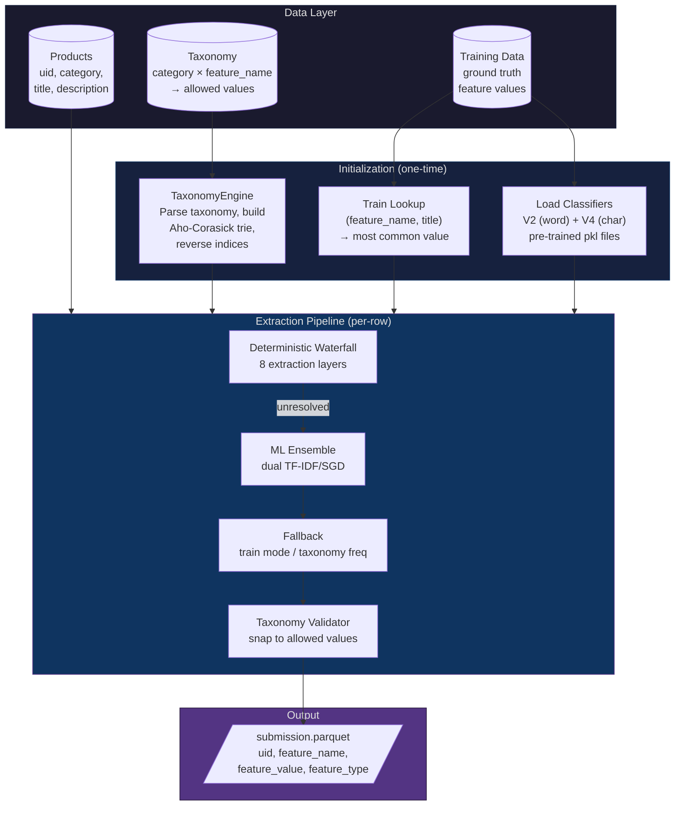
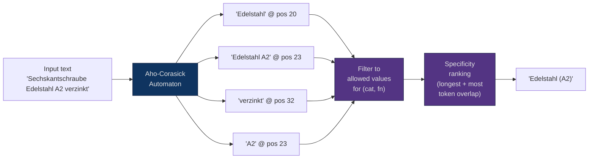
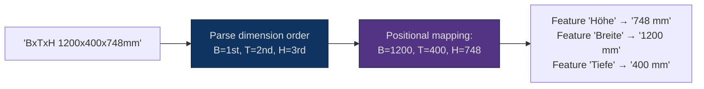
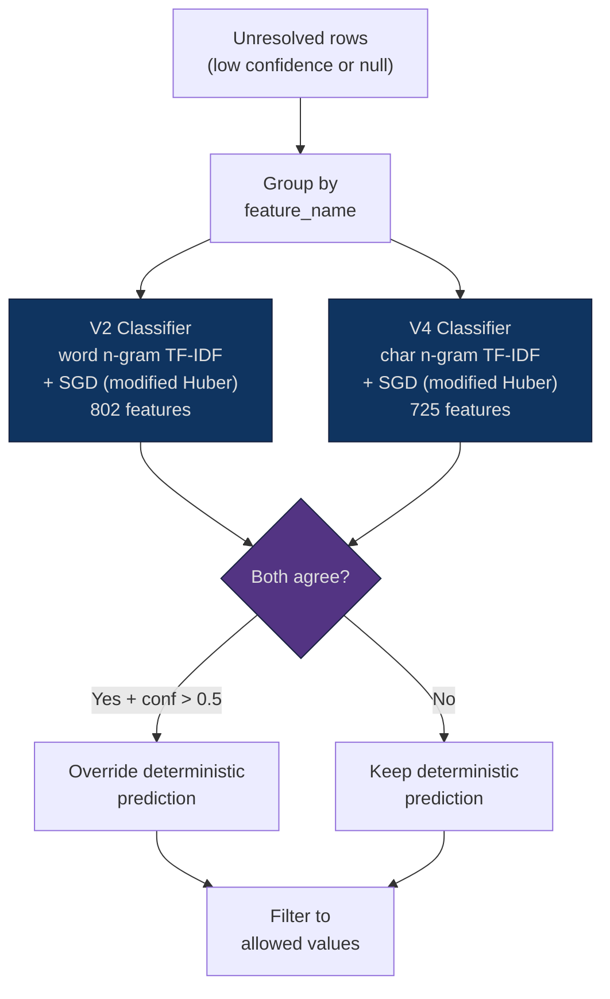
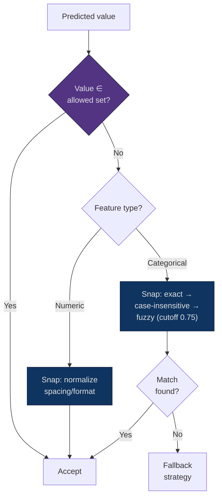
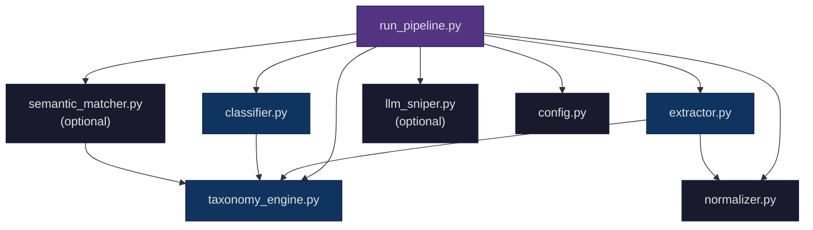

# Architecture Deep-Dive

> Technical reference for the taxonomy-constrained feature normalization engine. For a summary, see [APPROACH_DOC.md](../APPROACH_DOC.md).

---

## System Overview

The system transforms unstructured German product catalog text into structured, taxonomy-constrained feature values. It operates as a **multi-layer waterfall pipeline** where each layer attempts extraction with decreasing confidence, and only unresolved rows cascade forward.



---

## Taxonomy Engine

The `TaxonomyEngine` is the backbone data structure, built once from `taxonomy.parquet` and shared across all layers.

### Data Structures Produced

| Structure | Type | Purpose |
|:---|:---|:---|
| `cat_lookup` | `{(cat, fn): [values]}` | Sorted allowed values (longest-first for substring matching) |
| `cat_sets` | `{(cat, fn): {lower→canonical}}` | Case-insensitive lookup for categorical values |
| `num_units` | `{(cat, fn): unit}` | Dominant unit per numeric feature (e.g., "mm", "kg") |
| `num_allowed` | `{(cat, fn): {values}}` | Example value set for numeric features |
| `feature_type` | `{(cat, fn): type}` | "categorical" or "numeric" |
| `trie` | Aho-Corasick automaton | All ~16K unique categorical values for O(text) matching |
| `value_to_keys` | `{lower_val: [keys]}` | Reverse index: value → which (cat, fn) slots it belongs to |

### Aho-Corasick Trie

All unique categorical values across the entire taxonomy (~16K values) are compiled into a single Aho-Corasick automaton. This enables **O(text length)** multi-pattern matching — the trie scans the text once and reports all matching values simultaneously.



**Key design choice:** The trie matches all values globally, then results are filtered to the current (category, feature_name) slot. This is faster than building per-slot tries.

---

## Deterministic Waterfall — Layer by Layer

### Layer 0: Train Title Lookup

**Mechanism:** Exact `(feature_name, title)` pair lookup against training data.

**Why it works:** Many products are re-listed with identical titles. If we've seen the exact title for this feature before, the most common value is almost certainly correct.

**Hit rate:** ~14% of rows resolved. Confidence: 0.95.

### Layer 1: Domain Rules

**Mechanism:** 15 targeted extractors built from error analysis on the validation set.

Each rule targets a specific high-impact feature pattern:

| Rule | Feature | Pattern | Example |
|:---|:---|:---|:---|
| Compound material | Material | base + grade in text | "Edelstahl" + "A2" → "Edelstahl (A2)" |
| Screw drive mapping | Antrieb | German terminology | "Pozidriv" → "Kreuzschlitz (Pozidriv)" |
| RAL color extraction | Korpusfarbe | "RAL NNNN" | "RAL 7035" → "RAL 7035 Lichtgrau" |
| Compartment counting | Fächeranzahl | "NxM Fächer" | "4x5 Fächer" → "20 Fächer" |
| DxL screw dimensions | Länge/Durchmesser | positional parsing | "M12x80" → Länge=80mm, Ø=12mm |
| Label width | Breite | WxH format | "50x25mm" → Breite=50mm |
| Range extraction | Spannbereich | "N-N unit" | "22-28mm" → von=22mm, bis=28mm |

### Layer 2: Structured Description Parser

**Mechanism:** Extract key:value pairs from product descriptions structured as "Technische Daten" (technical specifications) sections.

```
Input description: "... Höhe: 1950 mm · Breite: 900 mm · Tiefe: 480 mm ..."
Output: {"Höhe": "1950 mm", "Breite": "900 mm", "Tiefe": "480 mm"}
```

The parser handles multiple separator formats (`·`, `•`, `<br>`, newlines) and matches extracted keys against feature name aliases (including Ø↔Durchmesser variants and domain-specific aliases like "Radkörper" → "Felgenmaterial").

### Layer 3: Special Format Extractors

**Mechanism:** Dedicated parsers for formats that require specific regex patterns:

- **Thread sizes:** `M12`, `M 12` → normalized `"M 12"`
- **Scale ratios:** `1:10`, `1/10` → normalized `":10"`
- **Drive sizes:** `PZ1`, `PH2`, `TX25` → normalized `"PZ 1"`, `"PH 2"`, `"T 25"`

### Layer 4: Dimension Parser

**Mechanism:** Positional extraction from dimension strings like `HxBxT 1950x900x480mm`.



The parser handles 8+ dimension order patterns (HxBxT, BxTxH, BxHxT, LxBxH, LxB, etc.) and maps each position to the correct feature name.

### Layer 5: Aho-Corasick Trie Matching

**Mechanism:** O(text) multi-pattern matching against all categorical taxonomy values, filtered to the current (category, feature_name) slot.

**Specificity ranking:** When multiple values match (e.g., both "Edelstahl" and "Edelstahl A2"), the system prefers the value where the most tokens appear in the text, with tie-breaking by value length (more specific = better).

### Layer 6: Regex Numeric Extraction

**Mechanism:** Auto-generated regex patterns from taxonomy units. For each (category, feature_name) with a known unit, a regex pattern `(\d+[.,]?\d*)\s*{unit}` is compiled.

**Heuristics:**
1. Title matches preferred over description matches (higher signal density)
2. Allowed-value matches preferred over novel values
3. For screw features: last mm-value in title = length, first = diameter

### Layer 7: Substring Fallback

**Mechanism:** Brute-force search for the longest allowed value as a substring of the text. Sorted longest-first to prefer more specific matches.

---

## ML Ensemble Layer



### Why Two Classifiers?

| Classifier | N-gram Type | Trained On | Strength |
|:---|:---|:---|:---|
| V2 | Word (1,2)-grams | category \| title \| desc | Captures word-level semantics |
| V4 | Char (2,4)-grams | title + desc | Captures morphological patterns, robust to German compounds |

### Strict Agreement Protocol

The ensemble only overrides a deterministic prediction when:
1. **Both** V2 and V4 predict the **same value**
2. The deterministic confidence is below **0.90**
3. The ensemble confidence exceeds **0.50**

This is a deliberate precision-over-recall choice. The cost of a wrong ML override (flipping a correct deterministic answer) is worse than leaving a low-confidence deterministic answer in place.

**Numeric features are never overridden by the ensemble.** Classifiers are poorly suited for continuous-value extraction.

---

## Validation & Fallback

### Taxonomy Validator

Every prediction passes through a final validation gate:



### Fallback Hierarchy

For rows still unresolved after all layers:

1. **Train global mode** — most frequent value for this feature_name in training data, if valid for this category
2. **Taxonomy frequency mode** — the allowed value that appears in the most categories (strongest prior)
3. **Any allowed value** — last resort, picks the first allowed value

---

## Normalizer

The normalizer handles German-specific formatting and unit conversion:

| Function | Input | Output |
|:---|:---|:---|
| German decimal | `"0,5"` | `"0.5"` |
| Unit conversion | `"500 ml"` (target: l) | `"0.5 l"` |
| Thread spacing | `"M2"` | `"M 2"` |
| Scale format | `"1:10"` | `":10"` |
| Drive size | `"PZ1"` | `"PZ 1"` |

Supported unit families: mm/cm/m, ml/cl/l, g/kg, W/kW, mAh/Ah, mV/V.

---

## Optional Layers (Built, Not Activated)

### Semantic Matcher (`semantic_matcher.py`)

Pre-embeds all ~16K taxonomy values with `all-MiniLM-L6-v2`, then matches unresolved product texts via cosine similarity. Uses batch encoding and normalized dot products for throughput.

**Why not activated:** The sentence-transformer adds a dependency and ~2 seconds of initialization. The marginal accuracy lift (~2-3% estimated) wasn't worth the added complexity under hackathon time constraints. The infrastructure is fully built and ready to activate with `--use-semantic`.

### LLM Sniper (`llm_sniper.py`)

Batched Claude Haiku caller for the bottom 1-3% of ambiguous rows. Includes cost tracking, token budgeting, and JSON output parsing.

**Why not activated:** $0 cost was a strategic choice to maximize the 40% cost rubric weight. The LLM layer is built and can be activated with `--use-llm` for scenarios where marginal accuracy justifies API cost.

---

## Module Dependency Graph


