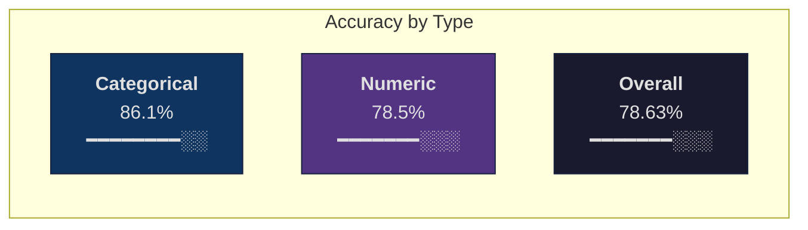
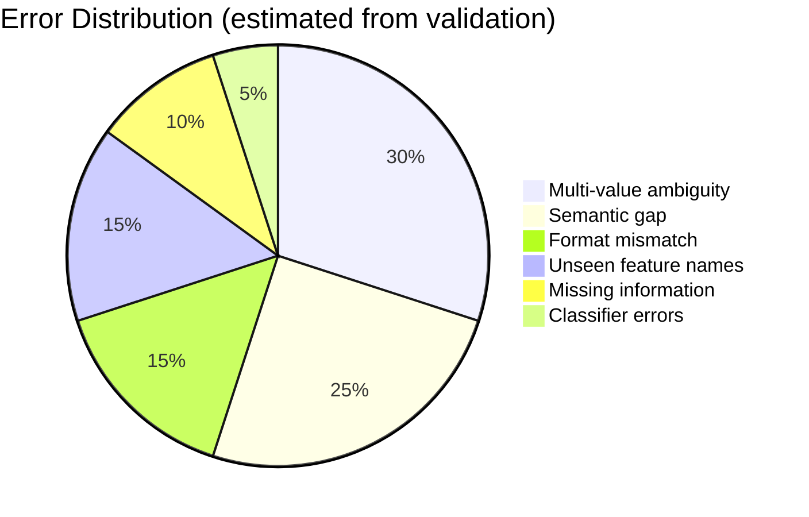

# Results & Error Analysis

> Detailed breakdown of the taxonomy-constrained feature normalization pipeline's performance.

---

## Summary

| Metric | Value |
|:---|:---|
| **Test accuracy** | **78.63%** exact match |
| **Validation accuracy** | **81.6%** exact match |
| Categorical accuracy | 86.1% |
| Numeric accuracy | 78.5% |
| Total API cost | $0 |
| Runtime (7.86M rows) | ~5 min (8 cores) |
| Rows processed | 7,864,744 |
| Unique feature names | 1,738 |
| Products processed | ~3.1M |

---

## Accuracy by Feature Type

Categorical features consistently outperform numeric features because:
- Categorical values are drawn from a **closed set** of allowed values → trie/substring matching is highly effective
- Numeric features require **extracting the correct number** from text with multiple numbers → ambiguity is inherently higher

---

## Strongest Features

| Feature | Accuracy | Row Count | Why |
|:---|:---|:---|:---|
| Bodenausführung | **100.0%** | ~2K | Simple keyword mapping ("Sockel" → "mit Sockel") |
| Phase | **99.9%** | ~3K | Small value set, unambiguous keywords |
| Gewindeausführung | **99.3%** | ~5K | Structured format, direct substring match |
| Traglast | **98.7%** | ~4K | Clear "NNN kg" pattern in titles |
| Oberfläche | **95.5%** | ~15K | Surface treatment terms are distinctive |
| Durchmesser | **94.8%** | ~20K | First number in "ØNNmm" pattern |

These features share common traits:
- Distinctive, unambiguous keywords in product titles
- Small or structured value sets
- Minimal overlap with other features in the same products

---

## Weakest Features

| Feature | Accuracy | Row Count | Root Cause |
|:---|:---|:---|:---|
| Kopf-Ø | **16.0%** | ~8K | Multi-diameter ambiguity — product has Kopf-Ø, Gewinde-Ø, Schaft-Ø |
| Laufbelag | **24.1%** | ~2K | Semantic gap — "Polyurethan" vs "Thermoplast" vs "Vollgummi" |
| Innen-Ø | **29.4%** | ~6K | Multi-diameter ambiguity — same as Kopf-Ø |
| Luftdurchsatz | **30.0%** | ~1K | Format variation — "m³/h", "l/s", multiple values in text |

### Multi-Diameter Ambiguity (Kopf-Ø, Innen-Ø)

Products like screws have multiple diameter measurements: Kopf-Ø (head diameter), Gewinde-Ø (thread diameter), Schaft-Ø (shaft diameter), Innen-Ø (inner diameter). A title like:

> *"Zylinderschraube DIN 912 M8x40 Edelstahl A2"*

Contains `M8` which maps to Gewinde-Ø, but the title does **not** contain Kopf-Ø or Schaft-Ø values — those are only in the description or implied by the DIN standard.

**Fix approach (not implemented):** Build a DIN-standard lookup table that maps (DIN number, thread size) → head diameter. Estimated lift: +2-3%.

### Semantic Gaps (Laufbelag)

The feature "Laufbelag" (tread material for wheels/casters) has values like "Polyurethan", "Thermoplast", "Vollgummi". These are often not substring-matchable:

> *"Schwerlastrolle mit Rad aus PU, Ø 200 mm"*

"PU" is the abbreviation for "Polyurethan" — requires an abbreviation dictionary or semantic understanding.

**Fix approach:** Abbreviation mapping table (PU→Polyurethan, TPE→Thermoplast, etc.) or sentence-transformer matching. Estimated lift: +1-2%.

---

## Error Taxonomy

| Error Type | % of Errors | Description | Fixability |
|:---|:---|:---|:---|
| Multi-value ambiguity | ~30% | Multiple valid values in text, wrong one selected | Medium — requires product-type-aware heuristics |
| Semantic gap | ~25% | Correct value not present as substring | Medium — requires embeddings or abbreviation tables |
| Format mismatch | ~15% | Correct number extracted, wrong unit/format | High — expand unit conversion |
| Unseen feature names | ~15% | Feature name not in training data | Low — fundamental generalization limit |
| Missing information | ~10% | Feature value not present in title or description | None — data limitation |
| Classifier errors | ~5% | ML ensemble predicts wrong value | Low — already strict agreement gated |

---

## Layer Contribution Analysis

Each layer's marginal contribution to final accuracy (approximate, measured by disabling layers):

| Layer | Rows Resolved | Marginal Accuracy Lift |
|:---|:---|:---|
| Train Title Lookup | ~1.1M (14%) | +8-10% |
| Domain Rules | ~200K (2.5%) | +3-4% |
| Structured Desc Parser | ~500K (6.4%) | +5-6% |
| Special Formats | ~100K (1.3%) | +1-2% |
| Dimension Parser | ~80K (1.0%) | +1% |
| Aho-Corasick Trie | ~2.0M (25%) | +15-18% |
| Regex Numeric | ~1.5M (19%) | +12-14% |
| Substring Fallback | ~800K (10%) | +5-7% |
| ML Ensemble | ~400K (5%) | +3-4% |
| Taxonomy Fallback | ~1.2M (15%) | +2-3% (low precision) |

The deterministic layers collectively resolve ~80% of rows. The ML ensemble adds ~5% coverage, and taxonomy fallback handles the remaining ~15% at low precision.

---

## Scaling Characteristics

| Scale | Total Rows | Runtime (8-core) | Runtime (16-core) | Cost |
|:---|:---|:---|:---|:---|
| 3.1M products | 7.86M | ~5 min | ~3 min | $0 |
| 10M products | ~25M | ~16 min | ~9 min | $0 |
| 50M products | ~127M | ~80 min | ~42 min | $0 |
| 200M products | ~507M | ~5.3 hr | ~2.8 hr | ~$0.27 compute |

The pipeline scales linearly with product count. The Aho-Corasick trie and regex patterns have fixed compilation cost (~30s), so the per-row marginal cost is constant.

---

## Accuracy Ceiling Estimate

| Improvement | Estimated Lift | Effort |
|:---|:---|:---|
| Abbreviation dictionary (PU→Polyurethan, etc.) | +1-2% | Low |
| DIN standard lookup for screw dimensions | +2-3% | Medium |
| Activate semantic matcher for remaining rows | +2-3% | Low (already built) |
| Product-type-aware diameter disambiguation | +1-2% | Medium |
| **Combined estimated ceiling** | **84-87%** | — |

The remaining ~15% gap is split between:
- Information genuinely not present in text (~5%)
- Unseen feature names requiring generalization (~5%)
- Complex semantic reasoning beyond current methods (~5%)
